# NPMSafe Workflow

## 🚦 Complete Publishing Workflow

```mermaid
graph TD
    A[Developer runs: npx npmsafe publish] --> B[🚦 NPMSafe Banner Displayed]
    B --> C[🔐 Secret Scan]
    C --> D{Secrets Found?}
    D -->|Yes| E[🚨 Block Publish]
    D -->|No| F[✅ Secret Scan Passed]
    F --> G[🔢 Version Analysis]
    G --> H[📝 Generate Changelog]
    H --> I[🧑‍💻 Git Status Check]
    I --> J{Git Clean?}
    J -->|No| K[⚠️ Warn: Uncommitted Changes]
    J -->|Yes| L[✅ Git Status Passed]
    L --> M[🏗️ CI Status Check]
    M --> N{CI Passing?}
    N -->|No| O[❌ Block: CI Failed]
    N -->|Yes| P[✅ CI Status Passed]
    P --> Q[🚦 Pre-publish Simulation]
    Q --> R{Simulation OK?}
    R -->|No| S[❌ Block: Simulation Failed]
    R -->|Yes| T[✅ Ready to Publish]
    T --> U[📦 Execute npm publish]
    U --> V[✅ Package Published]
    V --> W[🔔 Send Webhooks]
    W --> X[📊 Update Analytics]
    X --> Y[🎉 Publish Complete!]
    
    style A fill:#4CAF50,stroke:#45a049,stroke-width:2px,color:#fff
    style Y fill:#4CAF50,stroke:#45a049,stroke-width:2px,color:#fff
    style E fill:#f44336,stroke:#d32f2f,stroke-width:2px,color:#fff
    style O fill:#f44336,stroke:#d32f2f,stroke-width:2px,color:#fff
    style S fill:#f44336,stroke:#d32f2f,stroke-width:2px,color:#fff
    style K fill:#ff9800,stroke:#f57c00,stroke-width:2px,color:#fff
```



## 🔐 Secret Scanning Process


## 🔢 Version Analysis Process


## 🚦 Safety Check Matrix

| Check | Command | Blocking | Description |
|-------|---------|----------|-------------|
| 🔐 Secret Scan | `npmsafe scan` | Configurable | Scans for API keys, tokens, secrets |
| 🔢 Version Check | `npmsafe version` | No | Analyzes commit history for version bump |
| 🧑‍💻 Git Status | `npmsafe publish` | Yes | Ensures clean working directory |
| 🏗️ CI Status | `npmsafe publish` | Configurable | Verifies CI/CD pipeline success |
| 📦 Package Size | `npmsafe dry-run` | No | Shows what will be published |
| 🔗 Registry Check | `npmsafe publish` | No | Validates target registry |
| 📝 Changelog | `npmsafe changelog` | No | Generates release notes |

## 🎯 Decision Points

### Publish Blocking Conditions
1. **Secrets Detected** - If `blockPublishOnSecret: true`
2. **Git Not Clean** - Uncommitted changes present
3. **CI Failed** - If `requireCI: true`
4. **Simulation Errors** - Critical issues in dry-run

### Warning Conditions
1. **Large Package Size** - Over 10MB
2. **Many Dependencies** - Over 100 direct deps
3. **Breaking Changes** - Major version bump
4. **High Entropy Strings** - Potential secrets

### Success Conditions
1. ✅ All safety checks passed
2. ✅ No blocking conditions met
3. ✅ Package ready for distribution
4. ✅ Webhooks sent successfully

## 🔄 Integration Points

### CI/CD Integration
```yaml
# .github/workflows/publish.yml
name: Publish Package
on:
  release:
    types: [created]
jobs:
  publish:
    runs-on: ubuntu-latest
    steps:
      - uses: actions/checkout@v3
      - uses: actions/setup-node@v3
        with:
          node-version: '18'
          registry-url: 'https://registry.npmjs.org'
      - run: npm ci
      - run: npm run build
      - run: npx npmsafe publish
        env:
          NODE_AUTH_TOKEN: ${{secrets.NPM_TOKEN}}
```

### Pre-commit Hook
```json
// .husky/pre-commit
#!/bin/sh
npx npmsafe scan --patterns "src/**/*" --exclude "node_modules/**"
```

### Package.json Scripts
```json
{
  "scripts": {
    "prepublishOnly": "npx npmsafe publish --dry-run",
    "publish:safe": "npx npmsafe publish",
    "scan": "npx npmsafe scan",
    "version": "npx npmsafe version --auto",
    "changelog": "npx npmsafe changelog"
  }
}
```

## 📊 Success Metrics

### Security Metrics
- **Secrets Prevented**: Number of secret leaks blocked
- **False Positives**: Incorrect secret detections
- **Scan Coverage**: Percentage of files scanned

### Workflow Metrics
- **Publish Success Rate**: Successful vs failed publishes
- **Time Saved**: Reduction in manual checks
- **Error Prevention**: Accidents avoided

### Adoption Metrics
- **Downloads**: Package usage statistics
- **Contributors**: Community engagement
- **Issues Resolved**: Problems solved for users 